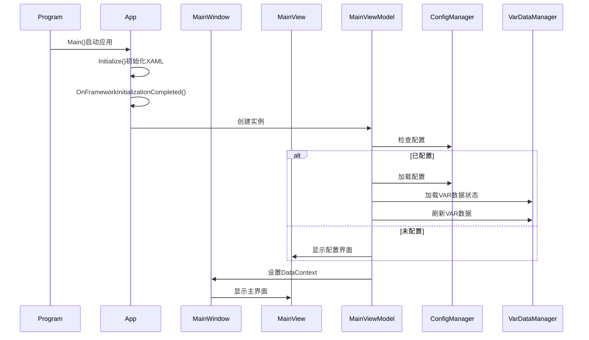

# VamTouch 项目分析报告

## 1. 项目概述
VamTouch 是一个基于 Avalonia UI 框架的 VAR 文件管理工具，采用 MVVM 架构，主要功能包括：
- VAR 文件目录管理
- VAR 文件列表展示（支持列表视图和网格视图）
- VAR 文件元数据解析
- VAR 文件状态管理

## 2. 技术栈
- 框架：Avalonia UI
- 语言：C#
- 架构模式：MVVM
- 依赖注入：Microsoft.Extensions.DependencyInjection
- 数据绑定：CommunityToolkit.Mvvm

## 3. 项目结构
```
VamTouch/
├── VamTouch.App/          # 应用层
│   ├── Views/             # 视图
│   ├── ViewModels/        # 视图模型
│   ├── Models/            # 数据模型
│   └── Services/          # 服务接口
├── VamTouch.Core/         # 核心层
│   ├── Models/            # 核心数据模型
│   └── Services/          # 核心服务实现
└── VamTouch.Tests/        # 测试层
```

## 4. 核心模块

### 4.1 应用启动流程


### 4.2 主要功能模块
- **VarDataManager**: 管理VAR文件数据，包括加载、刷新、保存状态等
- **VarParser**: 解析VAR文件，提取meta.json数据
- **FileManager**: 处理文件操作，如扫描、删除、打开文件位置等
- **ConfigManager**: 管理应用配置

## 5. 关键设计
- 使用依赖注入管理服务
- 采用异步编程处理文件操作
- 通过数据绑定实现UI更新
- 使用JSON序列化保存VAR数据状态

## 6. 改进建议
1. 增加单元测试覆盖率
2. 优化VAR文件解析性能
3. 添加文件预览功能
4. 支持批量操作
5. 增加文件分类过滤功能